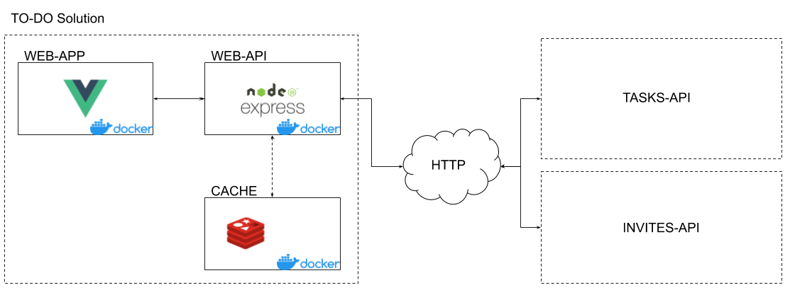
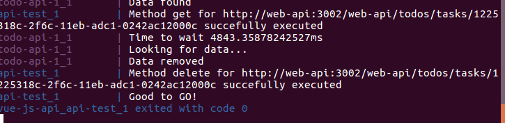
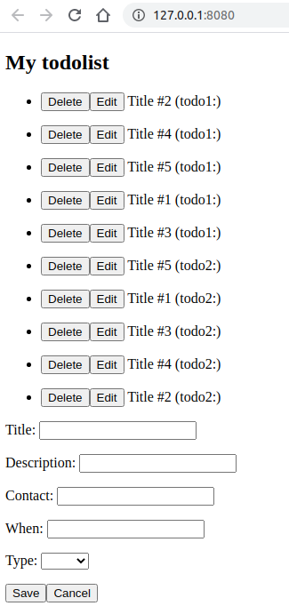

# TODO Solution

Hi, it seems you are the new software engineer for the TODO Solution project. On the following text you will understand how the project is structured and how you can help it to evolve.

## Solution and Architecture

Basically the TODO Solution is a web application that helps its users to manage their tasks or invites. The application is managed by a docker-compose file that is reponsible to build the artifacts and make them available to each other.

Inside this environment we have one application that is responsible to provide the user interface (WEB-APP) and another is responsible to provide as RESTFUL API that will be consumed by the web interface (WEB-API).



And as you can see the solution relies on two external services that provide services to store and manage each kind of TODO.

> These two application are part of the docker-compose to help you understand the issues.


## Dependencies

- Docker version 19 (in my environment I have this version: Docker version 19.03.13, build 4484c46d9d)
- Node 10 or supperior (in my environment I have this version: v10.20.1)
- Code Editor. Anyone. I've using VS Code with no issues so far
- SO: As the application is based on public plataforms (Docker and Node), the application should work properly on any SO you have. The application were tested on a Linux with this Ubuntu version: Ubuntu 16.04.7 LTS
- Browser. I like Chrome, but you can use anyone you want.

## Build, deploy & Test

1. Clone the project
2. Go to the root folder of the project
3. Execute the up & build command from Docker-Compose
```
docker-compose up --build
```
If everything went OK you will see a message like that after some minutes: 

> If not that's the first issue you need to solve. :grimacing:

And if you go to http://127.0.0.1:8080 in your browser you should see something like that:


## Challenges

If you use the application you will realise that there some issues that you and your team need to solve. I will list some of them here, but you may find other else along the way. Nobody knows.

1. When the WEB-API application is running it doesn't take into account the errors that the integrations can throws;
2. There is no separation of concerns on the WEB-API. The code needs to be better designed to make it more readable and understandable
3. There is a issue when you are trying to edit the TODOs that came from one of the sources;
4. When the WEB-APP requests the TODOs, even if some of the sources fail it would  be great if the user can see the data from the other source
5. The WEB-APP doesn't take into account failures calling the REST API provided by the WEB-API
6. It seems the project doesn't have any unit tests. What you think about that?
7. From time to time the external APIs take more than the expected (more than 2 seconds). Maybe it would be great to bring some mechanism to give the user a better experience

## What you need to do

Our team has a reputation that we can trust, whatever the challenge. Thus, you all will have sometime to engage on understand the application and try to find a solution for some of the issues reported above.

Given the time you have we don't expect the best solution but we will evaluate the analytical way to find the solution. You can use any tool available: books, internet, request help from some friend, anything.

But pay attention: one of our values is the team work. Thus, it is expected that all the solutions and proposal are discussed and demonstrate that you are able to work as a team to face the challenges.